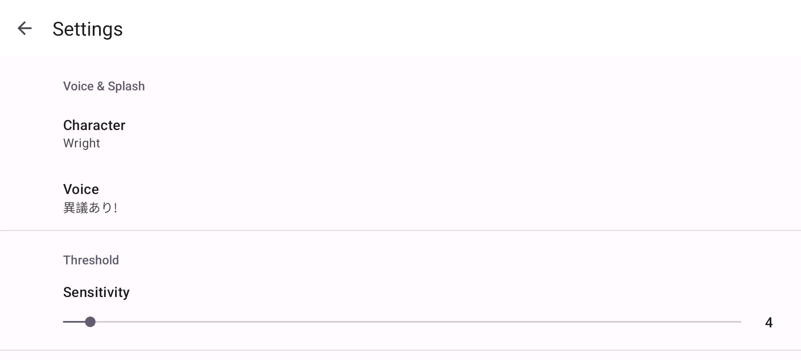

# Objection! v1.6

> Auto Objection! Place the phone flat on the table and knock the desktop.

## Download

Download the latest version(apk): [https://github.com/the0cp/objection/releases](https://github.com/the0cp/objection/releases)

## Usage

Place the phone flat on the table and knock the desktop, the App will automatically pop-up the "Objection!" banner.

## Widget & Live Wallpaper

- Widget(resizable)

- Live Wallpaper

## Preferences

## Support Characters

- Phoenix Wright
- Apollo Justice
- Miles Edgeworth
- Dhurke Sahdmadhi
- Ga'ran Sigatar Khura'in
- Godot</item>
- Manfred von Karma
- Franziska von Karma
- Nahyuta Sahdmadhi
- Mia Fey
- Klavier Gavin
- Athena Cykes
- Simon Blackquill
- Winston Payne

## Support Languages

- English
- Japanese
- ~Chinese~ (No longer supported, no complete voice found)

## TODO
- [x] Add more voices    
- [x] Add voice toggle
- [x] Add widget